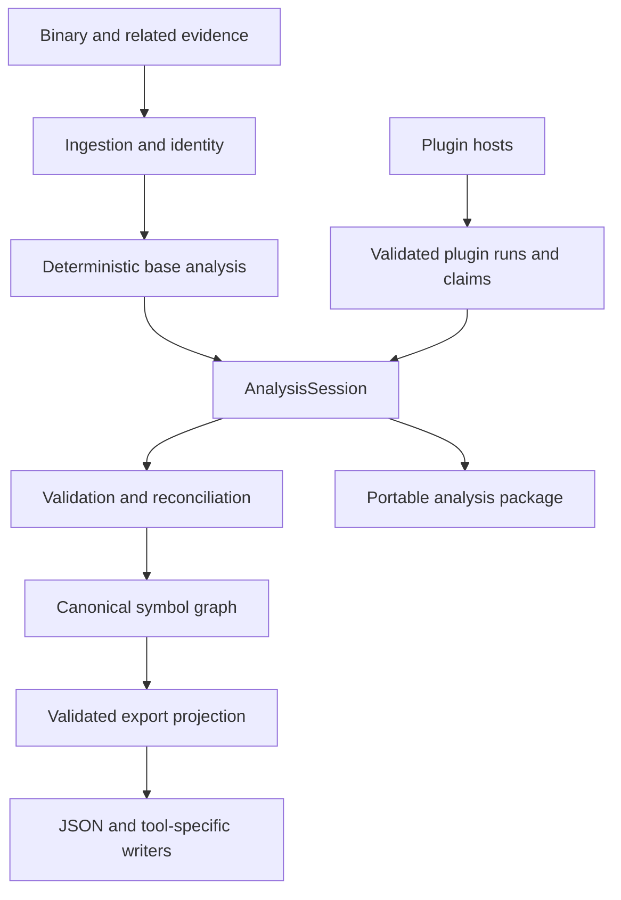

# ReSymbol architecture

This document records the intended architecture and the invariants that new components should
preserve. ReSymbol is in early development; sections marked as design describe the target system,
not necessarily behavior implemented in the current checkout.

The current implementation covers bounded PE32+ x86-64 ingestion, a conservative metadata-derived
symbol graph, modern MSVC x64 Rev1 RTTI/vftable discovery, canonical JSON `.resym` packages, plugin
discovery/contracts, and the first trusted external-process analysis runtime. It also includes a
validated, debugger-neutral export projection, deterministic Microsoft-linker-style MAP output,
an exact-RSDS public-symbol PDB writer, and conservative standalone import-script generators for
IDA and Ghidra. Broader disassembly-assisted discovery, matching, semantic inference, interactive
debugger bridges, richer PDB and DWARF output, the workbench GUI, and the WASM/native/managed
execution hosts remain design work.

## Goals

ReSymbol should:

- reconstruct useful symbol and type information from evidence left in compiled programs;
- preserve the difference between observed facts, structural matches, semantic inferences, and
  human review;
- support independent analyzers, matchers, symbol sources, inference providers, and exporters;
- run as a portable application without making users assemble a compiler toolchain;
- survive malformed binaries and unhealthy plugins without corrupting an analysis; and
- produce reproducible, portable results that are not tied to one disassembler or debugger.

ReSymbol cannot guarantee recovery of original source identifiers, filenames, line tables, or
types after those details have been removed. Useful reconstruction and exact recovery are different
claims and must remain visibly different in the data model and UI.

## System overview

The Rust application owns identity, canonical state, validation, permissions, transactions, and
plugin lifecycle. Extensions perform bounded work through versioned contracts. They submit claims
and evidence; they do not receive an unrestricted mutable reference to the graph.

## Processing stages

### 1. Ingestion and binary identity

The ingestion layer is responsible for:

- cryptographic file identity and format detection;
- architecture, endianness, image base, section, and address-space normalization;
- bounds-checked access to binary regions;
- recording build identifiers when the format exposes them; and
- linking optional related evidence such as another build, an existing symbol file, or a user
  annotation set.

All downstream records use canonical address concepts rather than assuming that file offsets,
virtual addresses, and relative virtual addresses are interchangeable.

### 2. Deterministic analysis

Deterministic analyzers extract information that can be traced directly to the input, including
imports, exports, executable ranges, unwind metadata, strings, cross-references, RTTI, vtables,
thunks, and candidate function boundaries. A finding can still be uncertain, but its uncertainty
must derive from a documented algorithm rather than being silently promoted to fact.

Analysis should be incremental. A plugin that resolves RTTI should not require the user to rerun an
unrelated signature index, and removing a plugin's results should not require rebuilding claims that
have no dependency on that plugin.

The implemented slice extracts PE image/section metadata, imports, exports, forwarded exports, x64
`RUNTIME_FUNCTION` records, bounded exact strings, supported RIP-relative data references, bounded
direct calls and thunks, and a bounded modern MSVC x64 RTTI/vftable subset without loading or
executing the input. Exact export names, corroborated metadata-backed boundaries, supported decoded
function entries and relationships, validated string literals, RTTI type/vftable names, and
function-to-class relationships from virtual slots become evidence-bearing graph claims. Broader
candidate discovery and unsupported evidence sources remain planned.

The x86-64 decoder is a pure-Rust, bounded linear sweep used only over complete file-backed
executable exception ranges and the first instruction at metadata-backed thunk seeds. The
implemented forms are `E8` internal calls, RIP-relative `FF 15` calls to exact parsed IAT slots,
`E9`/`EB` internal thunks, and RIP-relative `FF 25` import thunks. Internal targets covered by known
runtime-function metadata are suppressed unless their RVA matches a recorded runtime-function
begin. Aggregate limits of 64 MiB, 1,000,000 instructions, 8,192 retained direct calls, 4,096
retained thunks, and 32,768 retained data references retain canonical prefixes when exhausted;
`code_recovery_scan_truncated` and `data_reference_scan_truncated` persist the applicable partial
state independently. Exhausting the shared decode budget makes both instruction-derived sets
partial. Overlapping
runtime-function ranges are preserved and may be swept and budgeted separately, so adversarial
overlap metadata can make the bounded pass partial earlier.

This sweep supplies heuristic-confidence evidence rather than a recursive, reachability-aware
disassembly. It can decode post-terminator bytes or embedded data as instructions and retain false
positives; an invalid encoding can stop one range and omit later control flow. The pass does not
turn entry evidence into a fabricated source name, size, basic-block model, or complete
control-flow graph.

The RTTI pass candidate-scans only file-backed initialized data sections that are readable,
non-writable, and non-executable. Vftables and their back-pointers, complete object locators,
class-hierarchy descriptors, base-class arrays, base-class descriptors, and nested hierarchy
descriptors must remain in those read-only scan sections. A referenced TypeDescriptor may instead
occupy any file-backed initialized, readable, non-executable data section, including normal
writable `.data`; writable sections are never candidate-scanned. A candidate is committed only
after that section policy, the Rev1 structure chain, and executable file-backed virtual targets
agree. The supported base-class descriptor is deliberately the modern 28-byte form with the
`BCD_HASPCHD` layout bit and nested class-hierarchy RVA; older descriptors and other ABI variants
are rejected rather than guessed.

The ABI does not encode a vftable slot count. ReSymbol therefore retains contiguous pointer-sized
entries only while they resolve to file-backed executable bytes, stops at the first nonmatching
entry, caps each table at 4,096 slots, and records slot-to-class relationships below the confidence
of the RTTI type and vftable identity itself.

Discovery scans at most 64 MiB of eligible section data for candidate back-pointers in RVA order;
validating a candidate performs additional individually bounded reads of referenced metadata and
slots. Locator candidates, vftables, base records, virtual slots, and name text are separately
bounded. Retained RTTI names have a 16 MiB aggregate budget. Candidate-local failures discard that
candidate; exhausting a scan or aggregate budget preserves already validated results and marks the
analysis as partial. The deterministic core pass is offline and never executes the analyzed image.

### 3. Matching and semantic inference

Matchers may compare a function or type against:

- known library signatures;
- a symbolized build of the same program;
- an earlier or later application build;
- reproducibly compiled open-source code; or
- an approved community symbol pack.

Optional semantic providers may inspect normalized disassembly, pseudocode, strings, call context,
and established neighboring facts. Their output is an inference and remains labeled as such.
ReSymbol's deterministic features must continue to work without a model or network service.

### 4. Claim validation and reconciliation

A claim identifies a subject, proposed property, confidence, provenance, and supporting evidence.
The core validates at least:

- binary identity and address ownership;
- value and type shape;
- plugin identity and API compatibility;
- evidence references and dependency relationships;
- resource and permission constraints; and
- conflicts with established facts or competing claims.

Reconciliation may select a preferred display value, but it must preserve credible alternatives and
their provenance. Confidence values are not averaged blindly; deterministic extraction, exact build
identity, structural matching, heuristic inference, and human review require distinct semantics.

### 5. Canonical symbol graph

The graph is format-neutral. Its planned entities include:

- binaries, images, sections, modules, and address ranges;
- functions, blocks, call edges, thunks, imports, and exports;
- globals, constants, strings, fields, parameters, and local variables;
- primitive, pointer, array, function, aggregate, enum, and class types;
- inheritance, vtable, ownership, and containment relationships;
- names and aliases with source and confidence;
- claims, evidence, plugin runs, human decisions, and invalidations; and
- export-specific mappings kept separate from canonical meaning.

Stable entity identifiers must not depend on a display name. Analysis packages are bound to binary
hashes and build identity so symbols cannot be silently applied to the wrong executable.

### 6. Persistence and export

The initial persistence boundary is implemented as a versioned, canonical JSON `.resym` envelope.
It binds the validated payload to an exact SHA-256 binary identity, enforces bounded reads, rejects
unsupported schemas or inconsistent identities, and uses create-new writes to avoid silent data
loss. Its `AnalysisSession` payload contains the deterministic base analysis, an auditable plugin
run ledger, and separately validated plugin claims. A combined symbol graph is derived from those
parts rather than allowing plugins to mutate the metadata graph. The serialized schema and future
migrations are the compatibility boundary; a richer storage backend may be added without changing
the canonical graph into a debugger database.

Exporters consume a bounded, read-only projection of one validated session. The initial projection
selects deterministic names and boundaries, preserves competing names, prototypes, type
definitions, attributed function entries, strings, data references, direct calls, thunks, class
memberships, confidence, and provenance where representable, assigns collision-safe output names,
and emits structured warnings when graph information must be reduced or omitted. Writers revalidate
that projection before serializing it.

The first writers serialize the projection as JSON, render bounded Markdown or
Microsoft-linker-style MAP text, emit an exact-RSDS public-symbol PDB, or generate self-contained
IDAPython and Ghidra Java import scripts. Each script checks the debugger's recorded input SHA-256
before mutation and maps RVAs through the loaded image base, so ordinary rebasing does not weaken
exact-build binding.
The scripts preserve existing IDA user-authored names and Ghidra names from sources other than
`DEFAULT`/`ANALYSIS`, avoid replacing existing function bodies, and continue after an individual
symbol cannot be applied. This is intentionally narrower than a long-lived tool-hosted bridge:
selected collision-safe function/global names and safe function boundaries are applied, while
source spellings, alternate names, confidence, provenance, prototypes, types, comments, and
relationships remain available in the neutral JSON but are not yet fully represented in the tool
database. In particular, validated vftable global names can be applied, but function entries without
a safe name or extent, direct calls, thunks, RTTI type creation, and function-to-class membership
metadata remain JSON-only; no virtual-method names are invented. The
generated Ghidra Java writer has a documented 20,000-record ceiling so its output stays within
practical Java/Ghidra compilation bounds.

The MAP writer consumes both the validated neutral projection and its matching PE analysis session
because the projection intentionally does not duplicate PE section-table detail. It emits one
group per final PE section, one-based `section:offset` addresses, and
preferred-image-base-plus-RVA values. Raw section-name bytes unsafe for the whitespace-delimited
layout are escaped deterministically, and `<resymbol>` identifies synthetic provenance instead of
inventing source object filenames. Only selected named symbols are candidates; when a selected
function and global share an RVA, the function wins, while an unnamed function suppresses nothing.
This is distinct from the mutation-aware IDA/Ghidra rule, where a global is suppressed only when a
function record is actually emitted.

MAP generation is currently PE-only and rejects a mismatched session/projection pair or a selected
symbol outside the real PE sections. It validates at most 262,144 selected function/global
candidates before same-RVA reduction and limits the complete output to 64 MiB. Conventional
semicolon comments retain the exact SHA-256 and file size, but Microsoft does not document those
comments as MAP fields and the text cannot enforce binary identity when consumed. This writer adds
no package or neutral-projection schema fields.

The initial PDB writer is a deliberately narrow PE-only path for selected public function and
global names. `resymbol export --format pdb` requires `--binary` with the exact original PE because
the `.resym` package does not embed executable bytes. Before writing, ReSymbol hashes those bytes
against the package, applies the strict PE32+ x86-64 header checks, and inspects the bounded PE debug
directory for exactly one well-formed CodeView `RSDS` record. Missing, malformed, or multiple RSDS
records fail rather than being guessed. The resulting PDB copies that record's GUID and age and the
PE's raw 40-byte section-table records verbatim; it does not trust the advisory PDB pathname as
identity and never rewrites the PE.

ReSymbol builds the deterministic, bounded MSF 7.00 container and its PDB, DBI, public-symbol,
global/public-index, and section-header streams in pure Rust. Ordinary users therefore need no
Visual Studio, DIA SDK, LLVM, or compiler installation to create the file. Selected names are
emitted as `S_PUB32` records with function/global flags and one-based PE section-relative
addresses. A selected function wins over a selected global at the same RVA, while an unnamed
function suppresses nothing. The first slice does not synthesize private symbols, compilands,
source files or lines, locals, prototypes, function extents, or type records. It is exercised on
Windows CI through native `llvm-pdbutil` stream inspection, its DIA-backed view, and a direct DIA
identity/public-symbol probe. Like MAP export, it adds no package or neutral-projection schema
fields.

PDB, MAP, DWARF, IDA, Ghidra, and other targets have different capabilities and must not force
their assumptions into the canonical graph. Richer PDB types, private symbols, and line data;
DWARF writers; and interactive debugger bridges remain planned. See
[exporting.md](exporting.md) for current behavior.

## Plugin boundary

ReSymbol supports several extension families because no single runtime fits binary parsing,
high-performance native analysis, managed tooling, model experiments, and debugger integration:

| Family | Intended use | Host boundary |
|---|---|---|
| WebAssembly | Portable analyzers, matchers, rules, and exporters | Planned capability sandbox |
| Native C/C++ | Existing reversing libraries and performance-critical work | Planned separate native host process |
| Managed/.NET | Managed analyzers, SDK consumers, and ecosystem integrations | Planned self-contained managed host process |
| External process | Python, model runtimes, proprietary SDKs, or heavyweight tools | Child process; bounded protocol, but no OS sandbox |
| Tool-hosted bridge | IDA, Ghidra, Binary Ninja, and debugger adapters | The host tool's process and API |

Native in-process loading may eventually be available as an explicit trusted performance mode. It
is never the safe default. Rust's native ABI is not a public plugin contract; native plugins use a
versioned C ABI with language wrappers.

The first implemented execution host is deliberately narrower than the complete design. It starts
an explicitly approved external-process plugin directly, without a shell, for one analysis request;
exchanges size- and count-bounded NDJSON; enforces a deadline and bounded diagnostics; and accepts
claims only as one validated transaction. Interactive `binary.read`/`read-binary` requests are
reserved and are not serviced by this one-shot host. A plugin failure discards its claim batch but
does not invalidate deterministic analysis or prevent the `.resym` package from being written.

Process separation contains ordinary crashes, not authority. The child still has the ambient
filesystem, network, and process access of the account running ReSymbol. Consequently a process
plugin requires explicit approval tied to its complete directory fingerprint before first
execution. The unchanged fingerprint may autoload later; any update invalidates that approval.
Manifest permissions constrain ReSymbol's protocol operations and data projections, not the
child's ambient operating-system access.

The current standalone IDAPython and Ghidra Java exporters implement a small identity-checking,
conservative application path without installing a persistent plugin in either tool. They do not
make the planned interactive tool-host boundary complete.

See [plugin-system.md](plugin-system.md) for discovery, health states, and contracts.

## Workbench GUI (design)

The approved GUI direction is a desktop analysis workbench organized around a central results and
evidence view, project and symbol navigation, contextual details, and a persistent activity and
diagnostics area. It must expose confidence, provenance, competing claims, plugin health, and
export losses instead of hiding them behind a single resolved label.

No GUI is implemented in the current alpha. [gui-design.md](gui-design.md) records the approved
layout, theme presets, semantic-color invariants, and accessibility requirements that a future UI
must preserve.

## Packaging boundary

The application is centered on one Rust executable. Official archives may also contain prebuilt,
version-matched plugin hosts and thin tool adapters, but ordinary users should not need to install a
compiler, language runtime, build system, or package manager. In particular:

- managed hosts are distributed self-contained;
- ordinary plugins are distributed already compiled;
- the implemented PDB exporter does not require a separate Visual Studio installation; and
- optional external services remain optional rather than preventing deterministic analysis.

Developer toolchains are a contributor concern, not an end-user installation step.

## Trust boundaries

1. **Input binaries are untrusted.** Parsers apply bounds and resource limits and should avoid
   unsafe code.
2. **Third-party plugins are untrusted by default.** External-process code is never launched before
   an explicit fingerprint-bound trust decision. Trust and quarantine records live in the
   host-owned `plugins/.resymbol/` directory, outside plugin-controlled directories.
3. **Native in-process code is fully trusted.** Enabling it is an explicit decision with a clear
   warning because it can corrupt memory or escape every application-level control.
4. **Remote content is untrusted.** Symbol servers, source indexes, registries, and model endpoints
   cannot directly create trusted facts.
5. **Tool bridges are separate trust domains.** A bridge must validate the binary identity and
   address mapping before applying an analysis inside another program.

The core should retain enough structured diagnostics to explain which boundary failed without
logging binary contents, source material, or secrets by default.

`plugin.disabled` remains an out-of-band manual stop switch and safe mode suppresses all
third-party execution. Unsafe launch, runtime, resource, claim, or protocol failures quarantine the exact
process-plugin fingerprint. Corrupt host state fails closed. Quarantine does not grant trust to an
updated artifact, and plugin failure never deletes the installed files.

## Compatibility

Compatibility is negotiated independently for:

- plugin manifest schema;
- plugin protocol or ABI;
- symbol-graph interchange schema;
- analysis package schema; and
- individual exporter behavior.

A plugin declares a supported API range. Unsupported plugins are marked incompatible rather than
loaded optimistically. Schema migrations are explicit and must preserve provenance. Before 1.0,
breaking changes are expected, but they still require version bumps and release notes.

The current CLI writes analysis-package schema 3 and can inspect or export schemas 1 and 2 through
explicit compatibility paths. It migrates schema 1 into a validated current session, rebuilds the
base graph from persisted legacy metadata, and never rewrites the source package. Schema 2 already
records direct calls and thunks but predates recovered strings and data references. Because a
package omits the analyzed binary bytes, compatibility loading cannot recreate absent recovery
results; obtaining them requires reanalyzing the exact original binary into a schema 3 package.

## Core invariants

The following responsibilities are not delegated to plugins:

- binary and analysis identity;
- canonical addressing;
- graph transaction and migration rules;
- claim validation and provenance;
- plugin permission and lifecycle enforcement;
- conflict semantics; and
- safe startup, disablement, and quarantine.

Extensions can propose new information and representations. Only the core decides whether a claim
is valid canonical state.
