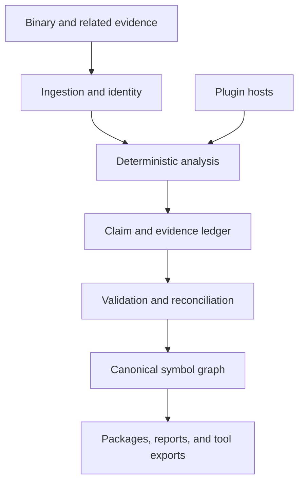

# ReSymbol architecture

This document records the intended architecture and the invariants that new components should
preserve. ReSymbol is in early development; sections marked as design describe the target system,
not necessarily behavior implemented in the current checkout.

The current implementation covers bounded PE32+ x86-64 ingestion, a conservative metadata-derived
symbol graph, canonical JSON `.resym` packages, and plugin discovery/contracts. Disassembly,
matching, plugin execution, semantic inference, and debugger-specific export remain design work.

## Goals

ReSymbol should:

- reconstruct useful symbol and type information from evidence left in compiled programs;
- preserve the difference between observed facts, structural matches, semantic inferences, and
  human review;
- support independent analyzers, matchers, symbol sources, inference providers, and exporters;
- run as a portable application without making users assemble a compiler toolchain;
- survive malformed binaries and unhealthy plugins without corrupting an analysis; and
- produce reproducible, portable results that are not tied to one disassembler or debugger.

ReSymbol cannot guarantee recovery of original source identifiers, filenames, line tables, or
types after those details have been removed. Useful reconstruction and exact recovery are different
claims and must remain visibly different in the data model and UI.

## System overview

The Rust application owns identity, canonical state, validation, permissions, transactions, and
plugin lifecycle. Extensions perform bounded work through versioned contracts. They submit claims
and evidence; they do not receive an unrestricted mutable reference to the graph.

## Processing stages

### 1. Ingestion and binary identity

The ingestion layer is responsible for:

- cryptographic file identity and format detection;
- architecture, endianness, image base, section, and address-space normalization;
- bounds-checked access to binary regions;
- recording build identifiers when the format exposes them; and
- linking optional related evidence such as another build, an existing symbol file, or a user
  annotation set.

All downstream records use canonical address concepts rather than assuming that file offsets,
virtual addresses, and relative virtual addresses are interchangeable.

### 2. Deterministic analysis

Deterministic analyzers extract information that can be traced directly to the input, including
imports, exports, executable ranges, unwind metadata, strings, cross-references, RTTI, vtables,
thunks, and candidate function boundaries. A finding can still be uncertain, but its uncertainty
must derive from a documented algorithm rather than being silently promoted to fact.

Analysis should be incremental. A plugin that resolves RTTI should not require the user to rerun an
unrelated signature index, and removing a plugin's results should not require rebuilding claims that
have no dependency on that plugin.

The implemented first slice extracts PE image/section metadata, imports, exports, forwarded
exports, and x64 `RUNTIME_FUNCTION` records without loading or executing the input. It promotes only
exact export names and corroborated, metadata-backed boundaries into the graph; broader candidate
discovery and the remaining evidence sources above are planned.

### 3. Matching and semantic inference

Matchers may compare a function or type against:

- known library signatures;
- a symbolized build of the same program;
- an earlier or later application build;
- reproducibly compiled open-source code; or
- an approved community symbol pack.

Optional semantic providers may inspect normalized disassembly, pseudocode, strings, call context,
and established neighboring facts. Their output is an inference and remains labeled as such.
ReSymbol's deterministic features must continue to work without a model or network service.

### 4. Claim validation and reconciliation

A claim identifies a subject, proposed property, confidence, provenance, and supporting evidence.
The core validates at least:

- binary identity and address ownership;
- value and type shape;
- plugin identity and API compatibility;
- evidence references and dependency relationships;
- resource and permission constraints; and
- conflicts with established facts or competing claims.

Reconciliation may select a preferred display value, but it must preserve credible alternatives and
their provenance. Confidence values are not averaged blindly; deterministic extraction, exact build
identity, structural matching, heuristic inference, and human review require distinct semantics.

### 5. Canonical symbol graph

The graph is format-neutral. Its planned entities include:

- binaries, images, sections, modules, and address ranges;
- functions, blocks, call edges, thunks, imports, and exports;
- globals, constants, strings, fields, parameters, and local variables;
- primitive, pointer, array, function, aggregate, enum, and class types;
- inheritance, vtable, ownership, and containment relationships;
- names and aliases with source and confidence;
- claims, evidence, plugin runs, human decisions, and invalidations; and
- export-specific mappings kept separate from canonical meaning.

Stable entity identifiers must not depend on a display name. Analysis packages are bound to binary
hashes and build identity so symbols cannot be silently applied to the wrong executable.

### 6. Persistence and export

The initial persistence boundary is implemented as a versioned, canonical JSON `.resym` envelope.
It binds the validated payload to an exact SHA-256 binary identity, enforces bounded reads, rejects
unsupported schemas or inconsistent identities, and uses create-new writes to avoid silent data
loss. Its serialized schema and future migrations are the compatibility boundary; a richer storage
backend may be added without changing the canonical graph into a debugger database.

Exporters consume a read-only graph projection and report what information could not be represented
by their target. PDB, DWARF, IDA, and Ghidra formats have different capabilities and should not
force their assumptions into the canonical graph. These exporters are not implemented yet.

## Plugin boundary

ReSymbol supports several extension families because no single runtime fits binary parsing,
high-performance native analysis, managed tooling, model experiments, and debugger integration:

| Family | Intended use | Default isolation |
|---|---|---|
| WebAssembly | Portable analyzers, matchers, rules, and exporters | Capability sandbox |
| Native C/C++ | Existing reversing libraries and performance-critical work | Separate native host process |
| Managed/.NET | Managed analyzers, SDK consumers, and ecosystem integrations | Self-contained managed host process |
| External process | Python, model runtimes, proprietary SDKs, or heavyweight tools | Framed RPC over a child process |
| Tool-hosted bridge | IDA, Ghidra, Binary Ninja, and debugger adapters | The host tool's process and API |

Native in-process loading may eventually be available as an explicit trusted performance mode. It
is never the safe default. Rust's native ABI is not a public plugin contract; native plugins use a
versioned C ABI with language wrappers.

See [plugin-system.md](plugin-system.md) for discovery, health states, and contracts.

## Packaging boundary

The application is centered on one Rust executable. Official archives may also contain prebuilt,
version-matched plugin hosts and thin tool adapters, but ordinary users should not need to install a
compiler, language runtime, build system, or package manager. In particular:

- managed hosts are distributed self-contained;
- ordinary plugins are distributed already compiled;
- a PDB exporter must not require a separate Visual Studio installation; and
- optional external services remain optional rather than preventing deterministic analysis.

Developer toolchains are a contributor concern, not an end-user installation step.

## Trust boundaries

1. **Input binaries are untrusted.** Parsers apply bounds and resource limits and should avoid
   unsafe code.
2. **Third-party plugins are untrusted by default.** Their runtime, permissions, and execution
   limits depend on the plugin family.
3. **Native in-process code is fully trusted.** Enabling it is an explicit decision with a clear
   warning because it can corrupt memory or escape every application-level control.
4. **Remote content is untrusted.** Symbol servers, source indexes, registries, and model endpoints
   cannot directly create trusted facts.
5. **Tool bridges are separate trust domains.** A bridge must validate the binary identity and
   address mapping before applying an analysis inside another program.

The core should retain enough structured diagnostics to explain which boundary failed without
logging binary contents, source material, or secrets by default.

## Compatibility

Compatibility is negotiated independently for:

- plugin manifest schema;
- plugin protocol or ABI;
- symbol-graph interchange schema;
- analysis package schema; and
- individual exporter behavior.

A plugin declares a supported API range. Unsupported plugins are marked incompatible rather than
loaded optimistically. Schema migrations are explicit and must preserve provenance. Before 1.0,
breaking changes are expected, but they still require version bumps and release notes.

## Core invariants

The following responsibilities are not delegated to plugins:

- binary and analysis identity;
- canonical addressing;
- graph transaction and migration rules;
- claim validation and provenance;
- plugin permission and lifecycle enforcement;
- conflict semantics; and
- safe startup, disablement, and quarantine.

Extensions can propose new information and representations. Only the core decides whether a claim
is valid canonical state.
